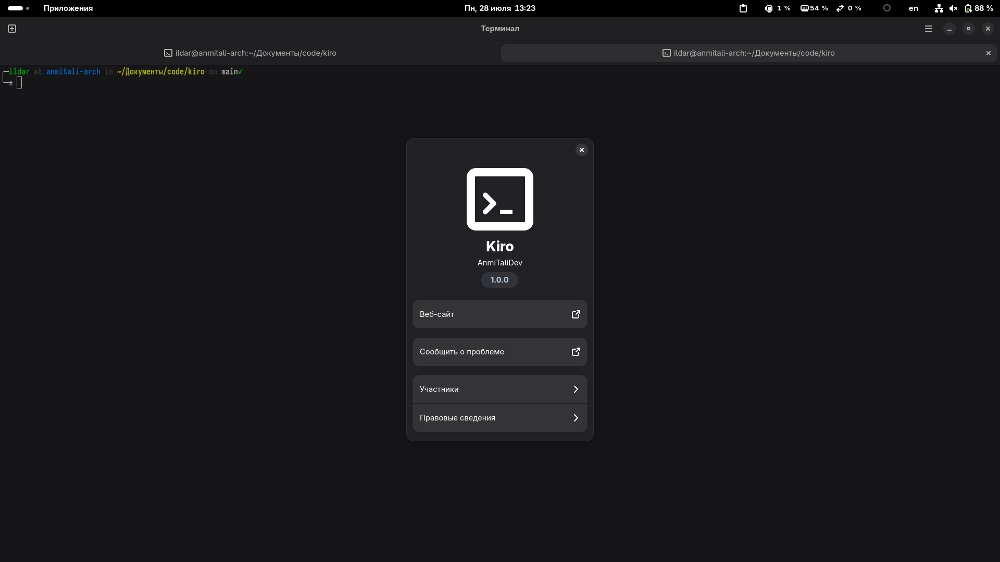

# Kiro Terminal Emulator

<p align="center">
  
  
  
  
</p>

Kiro is a modern and elegant terminal emulator built with GTK4 and LibAdwaita, designed to integrate seamlessly with the GNOME desktop environment. It offers a clean, contemporary interface with extensive customization options while maintaining excellent performance.

## Features

### Core Functionality
- **Modern GTK4 and LibAdwaita interface** - Native GNOME integration with adaptive design
- **Tabbed interface** - Support for multiple terminal sessions in a single window
- **Full VTE integration** - Robust terminal emulation with complete feature support
- **Unicode and UTF-8 support** - Proper handling of international characters and emojis

### Appearance & Theming
- **System theme integration** - Automatically adapts to light/dark themes
- **Custom color schemes** - Full color palette customization
- **Font configuration** - Choose any monospace font with size adjustment
- **Transparency support** - Configurable background and window transparency
- **Multiple cursor styles** - Block, I-beam, and underline cursor shapes with blinking options

### User Experience
- **Copy on select** - Optional automatic clipboard copying
- **Hyperlink detection** - Click to open URLs and file paths
- **Drag & drop support** - Drop files directly into terminal
- **Context menu** - Right-click menu with common actions
- **Keyboard shortcuts** - Full set of configurable shortcuts
- **Mouse autohide** - Hide cursor while typing

### Advanced Features
- **Configurable scrollback** - Up to 100,000 lines of history
- **Custom shell support** - Use any shell or run custom commands
- **Bell notifications** - Audible and visual bell options
- **Window management** - Remember size, always-on-top, and more
- **Multi-language support** - Currently supports English and Russian

## Screenshots



## Installation

### From Source

#### Prerequisites
Ensure you have the following dependencies installed:

**Ubuntu/Debian:**
```bash
sudo apt install build-essential meson ninja-build valac
sudo apt install libgtk-4-dev libadwaita-1-dev libvte-2.91-gtk4-dev
sudo apt install libglib2.0-dev gettext appstream-util desktop-file-utils
```

**Fedora:**
```bash
sudo dnf install gcc meson ninja-build vala
sudo dnf install gtk4-devel libadwaita-devel vte291-gtk4-devel
sudo dnf install glib2-devel gettext appstream desktop-file-utils
```

**Arch Linux:**
```bash
sudo pacman -S base-devel meson ninja vala
sudo pacman -S gtk4 libadwaita vte4
sudo pacman -S glib2 gettext appstream desktop-file-utils
```

#### Build Instructions

1. **Clone the repository:**
   ```bash
   git clone https://github.com/AnmiTaliDev/kiro.git
   cd kiro
   ```

2. **Configure the build:**
   ```bash
   meson setup builddir
   ```

3. **Compile:**
   ```bash
   meson compile -C builddir
   ```

4. **Install:**
   ```bash
   sudo meson install -C builddir
   ```

5. **Update system databases:**
   ```bash
   sudo update-desktop-database
   sudo glib-compile-schemas /usr/local/share/glib-2.0/schemas/
   ```

### Uninstalling
```bash
sudo ninja uninstall -C builddir
```

## Usage

### Basic Usage
- **Launch Kiro:** `kiro` or find it in your applications menu
- **New tab:** `Ctrl+Shift+T`
- **Close tab:** `Ctrl+Shift+W`
- **Copy:** `Ctrl+Shift+C`
- **Paste:** `Ctrl+Shift+V`
- **Preferences:** `Ctrl+,`

### Command Line Options
```bash
kiro --new-window    # Open a new window
kiro --new-tab       # Open a new tab
kiro --preferences   # Open preferences dialog
```

### Keyboard Shortcuts

| Action | Shortcut |
|--------|----------|
| New Tab | `Ctrl+Shift+T` |
| Close Tab | `Ctrl+Shift+W` |
| Copy | `Ctrl+Shift+C` |
| Paste | `Ctrl+Shift+V` |
| Select All | `Ctrl+Shift+A` |
| Zoom In | `Ctrl++` |
| Zoom Out | `Ctrl+-` |
| Reset Zoom | `Ctrl+0` |
| Reset Terminal | `Ctrl+Shift+R` |
| Clear Terminal | `Ctrl+Shift+K` |
| Preferences | `Ctrl+,` |
| Quit | `Ctrl+Q` |

## Configuration

Kiro stores its settings using GSettings. You can access preferences through the GUI (`Ctrl+,`) or modify settings directly:

### Via GUI
Open preferences with `Ctrl+,` or through the main menu. Settings are organized into categories:
- **General:** Shell and window behavior
- **Appearance:** Fonts, colors, and cursor settings
- **Behavior:** Scrolling, mouse, and bell options
- **Advanced:** Text selection and performance settings

### Via Command Line
```bash
# View current font setting
gsettings get dev.anmitali.kiro font

# Set a custom font
gsettings set dev.anmitali.kiro font 'JetBrains Mono 14'

# Enable copy on select
gsettings set dev.anmitali.kiro copy-on-select true

# Set custom colors
gsettings set dev.anmitali.kiro use-theme-colors false
gsettings set dev.anmitali.kiro foreground-color '#ffffff'
gsettings set dev.anmitali.kiro background-color '#1e1e1e'
```

### Reset Settings
```bash
# Reset all settings to defaults
gsettings reset-recursively dev.anmitali.kiro
```

## Development

### Building for Development
```bash
# Configure with debug symbols
meson setup builddir --buildtype=debug

# Build and run
meson compile -C builddir
./builddir/src/kiro
```

### Adding Translations
1. Add your language code to `po/LINGUAS`
2. Create a new `.po` file: `cp po/en.po po/your_lang.po`
3. Translate the strings in your `.po` file
4. Test the translation: `LANG=your_lang ./builddir/src/kiro`

### Contributing
Contributions are welcome! Please:
1. Fork the repository
2. Create a feature branch
3. Make your changes
4. Test thoroughly
5. Submit a pull request

## System Requirements

### Minimum Requirements
- **OS:** Linux with GTK4 support
- **GTK:** 4.8.0 or newer
- **LibAdwaita:** 1.2.0 or newer
- **VTE:** 0.70.0 or newer (GTK4 version)
- **GLib:** 2.66.0 or newer
- **Vala:** 0.56.0 or newer (for building)

### Recommended
- **GNOME:** 42 or newer for best integration
- **Compositor:** For transparency effects
- **Fonts:** JetBrains Mono, Fira Code, or any good monospace font

## Troubleshooting

### Common Issues

**Build fails with "Package not found":**
- Ensure all development packages are installed
- Check that you have the GTK4 versions of VTE (`vte-2.91-gtk4`)

**Terminal doesn't start:**
- Check your shell configuration
- Try with a different shell in preferences
- Verify `$SHELL` environment variable

**Colors look wrong:**
- Try toggling "Use System Theme Colors" in preferences
- Reset color settings to defaults
- Check your system theme compatibility

**Fonts not working:**
- Install the desired font system-wide
- Use the full font name in preferences
- Try with a standard monospace font first

### Debug Mode
Run with debug output:
```bash
G_MESSAGES_DEBUG=all ./builddir/src/kiro
```

## License

Kiro is licensed under the GNU General Public License v3.0 or later. See [LICENSE](LICENSE) for the full license text.

## Links

- **Homepage:** https://github.com/AnmiTaliDev/kiro
- **Bug Reports:** https://github.com/AnmiTaliDev/kiro/issues
- **Discussions:** https://github.com/AnmiTaliDev/kiro/discussions
